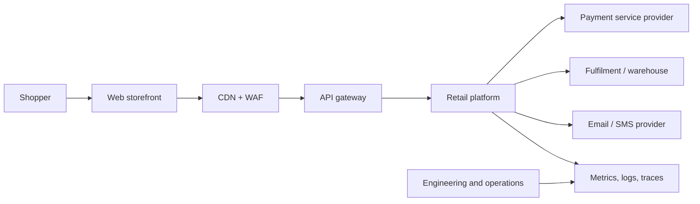
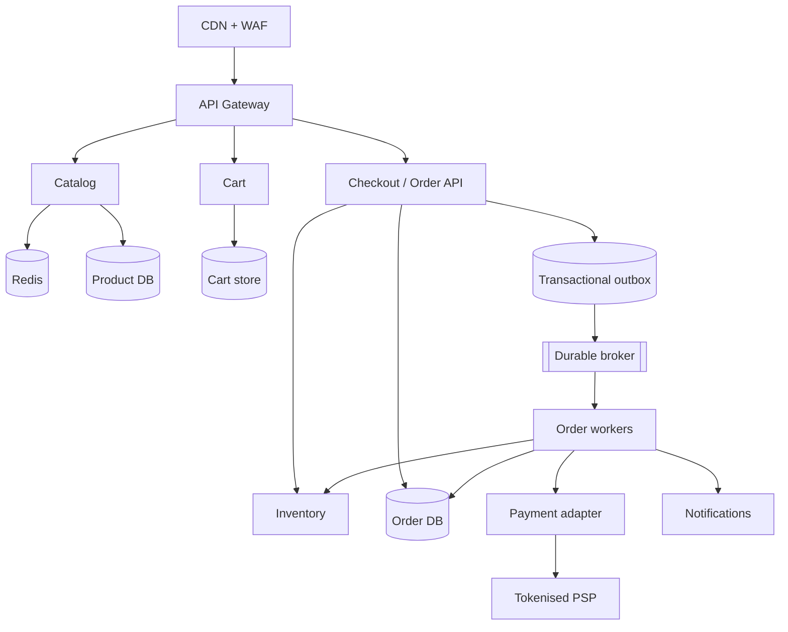
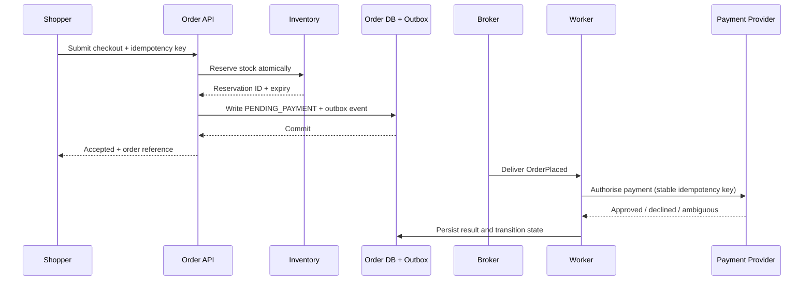
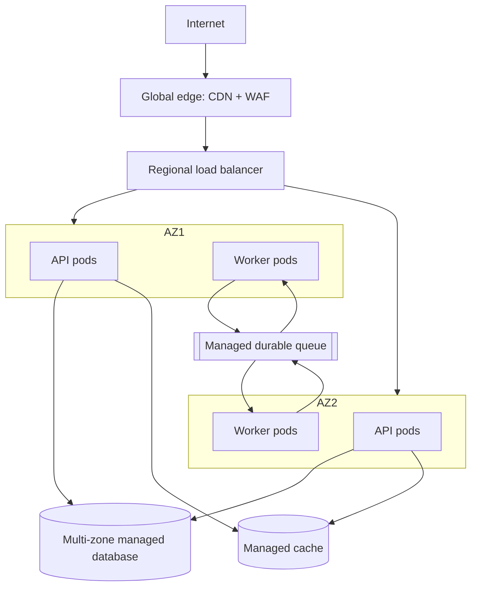
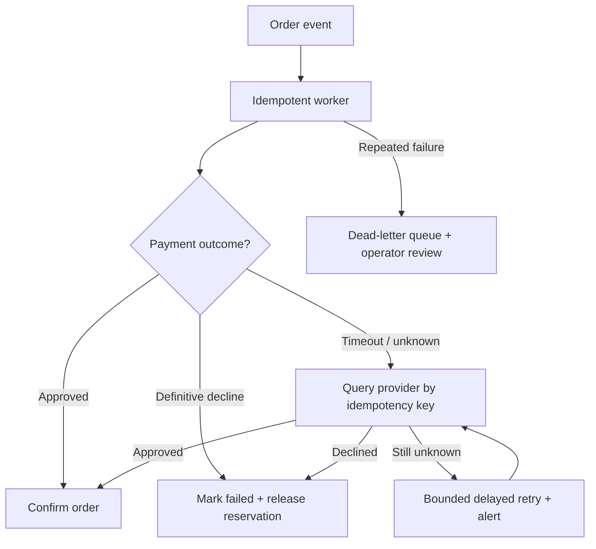

# Architecture diagrams

## System context

```mermaid
flowchart LR
  Shopper[Shopper] --> Storefront[Web storefront]
  Storefront --> Edge[CDN + WAF]
  Edge --> API[API gateway]
  API --> Platform[Retail platform]
  Platform --> PSP[Payment service provider]
  Platform --> Fulfilment[Fulfilment / warehouse]
  Platform --> Messaging[Email / SMS provider]
  Ops[Engineering and operations] --> Telemetry[Metrics, logs, traces]
  Platform --> Telemetry
```

## Logical architecture

```mermaid
flowchart TB
  Edge[CDN + WAF] --> Gateway[API Gateway]
  Gateway --> Catalog[Catalog]
  Gateway --> Cart[Cart]
  Gateway --> Checkout[Checkout / Order API]
  Catalog --> Cache[(Redis)]
  Catalog --> ProductDB[(Product DB)]
  Cart --> CartDB[(Cart store)]
  Checkout --> Inventory[Inventory]
  Checkout --> OrderDB[(Order DB)]
  Checkout --> Outbox[(Transactional outbox)]
  Outbox --> Broker[[Durable broker]]
  Broker --> Worker[Order workers]
  Worker --> Payment[Payment adapter]
  Payment --> PSP[Tokenised PSP]
  Worker --> Inventory
  Worker --> Notify[Notifications]
  Worker --> OrderDB
```

## Order processing sequence

```mermaid
sequenceDiagram
  participant U as Shopper
  participant O as Order API
  participant I as Inventory
  participant DB as Order DB + Outbox
  participant Q as Broker
  participant W as Worker
  participant P as Payment Provider
  U->>O: Submit checkout + idempotency key
  O->>I: Reserve stock atomically
  I-->>O: Reservation ID + expiry
  O->>DB: Write PENDING_PAYMENT + outbox event
  DB-->>O: Commit
  O-->>U: Accepted + order reference
  Q->>W: Deliver OrderPlaced
  W->>P: Authorise payment (stable idempotency key)
  P-->>W: Approved / declined / ambiguous
  W->>DB: Persist result and transition state
```

## Deployment topology

```mermaid
flowchart TB
  Internet --> Edge[Global edge: CDN + WAF]
  Edge --> LB[Regional load balancer]
  LB --> AZ1[Availability zone A]
  LB --> AZ2[Availability zone B]
  subgraph AZ1
    A1[API pods]
    W1[Worker pods]
  end
  subgraph AZ2
    A2[API pods]
    W2[Worker pods]
  end
  A1 --> DB[(Multi-zone managed database)]
  A2 --> DB
  W1 --> MQ[[Managed durable queue]]
  W2 --> MQ
  MQ --> W1
  MQ --> W2
  A1 --> Cache[(Managed cache)]
  A2 --> Cache
```

## Failure and recovery

```mermaid
flowchart TD
  Event[Order event] --> Consumer[Idempotent worker]
  Consumer --> Outcome{Payment outcome?}
  Outcome -->|Approved| Confirm[Confirm order]
  Outcome -->|Definitive decline| Fail[Mark failed + release reservation]
  Outcome -->|Timeout / unknown| Reconcile[Query provider by idempotency key]
  Reconcile -->|Approved| Confirm
  Reconcile -->|Declined| Fail
  Reconcile -->|Still unknown| Retry[Bounded delayed retry + alert]
  Retry --> Reconcile
  Consumer -->|Repeated failure| DLQ[Dead-letter queue + operator review]
```
